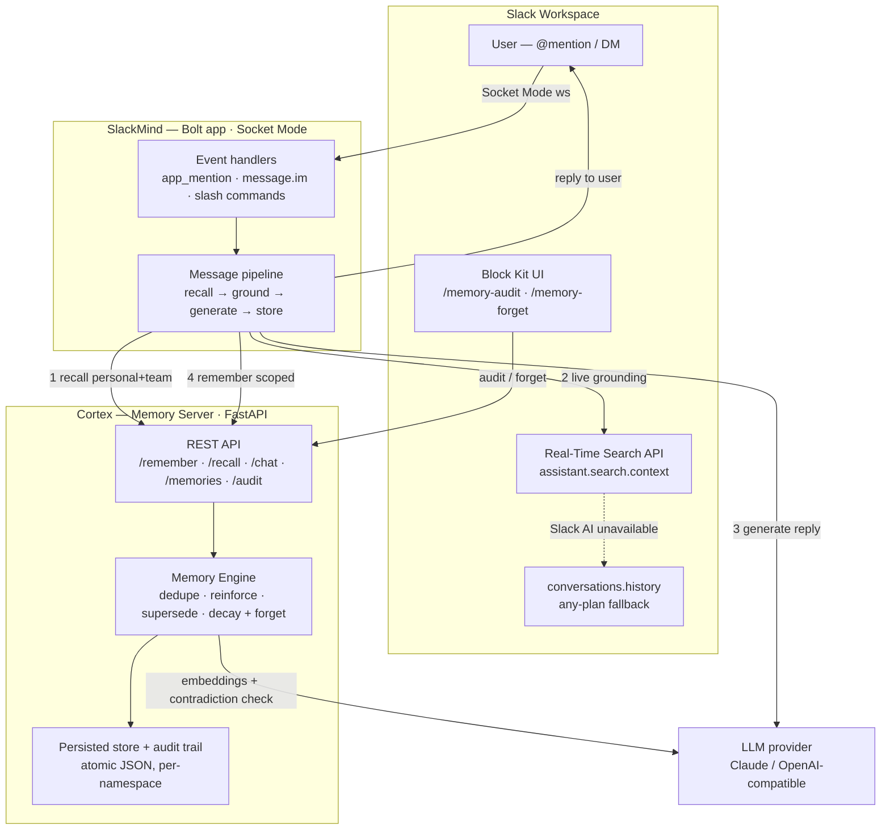

# SlackMind

A Slack agent with **real long-term memory** and **real-time workspace
grounding** — built for the Slack Agent Builder Challenge, submitting to the
**"New Slack Agent"** track (deadline Jul 13 2026, 5pm PDT).

## The concept

Every AI assistant bolted onto Slack today has the same problem: it forgets
you the moment the conversation scrolls away. Ask it something on Monday,
re-explain the same context on Wednesday. SlackMind fixes that by pairing
Slack's own Bolt SDK with two things:

1. **[Cortex](../cortex)** — a sibling project, a self-pruning, multi-tenant
   memory server with a real governance model: new facts *dedupe* against
   existing ones instead of piling up, recall *reinforces* what matters
   (salience grows with use), contradictory information *supersedes* the old
   fact instead of leaving stale data around, and unused memories *decay and
   get forgotten* on a salience-scaled half-life — with every one of those
   lifecycle events written to a queryable audit trail. Cortex runs as its
   own FastAPI process; SlackMind talks to it purely over its REST API
   (`POST /remember`, `POST /recall`, `POST /chat`, `GET /memories`,
   `GET /audit`, `DELETE /memories/{id}`) — never by trying to spawn Cortex's
   MCP stdio server as a subprocess, which isn't practical across a
   Slack-bot/memory-server process boundary.
2. **Slack's Real-Time Search API** (`assistant.search.context`) — for the
   other half of "the bot doesn't know things": questions that need *fresh,
   in-workspace* context (what did the team just decide in #proj-gizmo?)
   rather than durable facts about the person asking. Memory answers "what
   do you know about me"; Real-Time Search answers "what's happening in this
   workspace right now."

   Semantic Real-Time Search is a Slack AI feature gated to Business+/
   Enterprise+ workspaces — `assistant.search.info` reports
   `is_ai_search_enabled: false` elsewhere. So SlackMind **degrades instead
   of losing the feature**: when semantic search isn't available (Free/Pro
   workspaces, or AI search simply off), it falls back to a keyword+recency
   scan of `conversations.history` across the channels the bot is in — plain
   Web API methods available on every plan. Higher-fidelity semantic search
   when the workspace has it; a real, working approximation when it doesn't.
   The bot checks the capability at runtime and picks the right path itself.

The result: mention SlackMind or DM it, and it answers using both what it
remembers (personal, and — in a channel — shared team memory, across every
channel and DM, forever, until it naturally decays) and what's actually
happening in the workspace *today*.

**Beyond plain recall, it does three things most memory bots don't:**

- **Reconciles memory against fresh reality**, not just against new
  statements. If a Real-Time Search hit contradicts a stored memory (memory
  says the deadline is Friday, a message just found says it moved to
  Monday), the bot says so explicitly and feeds the correction back through
  the same contradiction-detection path a person's own correction would use
  — it doesn't silently pick one and ignore the conflict.
- **Distinguishes personal from team memory.** Say something in a channel
  that sounds like a team decision, and it's stored in a namespace any
  member of that channel can recall from — not locked to whoever said it.
  Personal preferences stay personal. This reuses Cortex's own
  (already-tested) multi-tenant namespace isolation; no new memory
  infrastructure needed, just two namespaces instead of one.
- **Lets you correct it, conversationally.** Say "forget that I said I
  prefer terse reviews" in plain language, and it finds the matching
  memory and shows a **confirm button** before anything is actually
  deleted — the model can suggest what might match, but a human click is
  what actually triggers the delete, every time. `/memory-forget <keyword>`
  is the same flow as a slash command, for when you'd rather not phrase it
  as a sentence.

## Architecture



*A message flows through the pipeline in four numbered steps (recall → ground → generate → store); Cortex's Memory Engine governs every write, and Real-Time Search falls back to `conversations.history` on workspaces without Slack AI. Full step-by-step below.*

## How a message flows

```
Slack message (@mention or DM)
        │
        ▼
Cortex POST /recall (personal namespace)
  + POST /recall (team namespace, channels only) ──► merged, scope-tagged memories
        │
        ▼
looks like it needs fresh info? ──► Slack assistant.search.context
        │                                (Real-Time Search; or, if the
        │                                 workspace lacks Slack AI, a
        │                                 conversations.history keyword scan)
        ▼
generate a reply (first available wins, none required):
  1. OPENAI_COMPAT_BASE_URL/API_KEY set → any OpenAI-compatible endpoint,
     given memory + search context, also emits a structured memory-
     extraction block (tagged personal/team) and, rarely, a forget-request
  2. else ANTHROPIC_API_KEY set        → direct Claude call, same contract
  3. else Cortex POST /chat            → Cortex's own recall+generate+store,
     (if Cortex has a model key)         using ITS model key instead
  4. else: canned reply                → still surfaces memory/search hits,
                                           stores a coarse heuristic memory,
                                           system stays demonstrably running
                                           with zero LLM keys configured
                                           anywhere
        │
        ▼
Cortex POST /remember (personal or team namespace, per extracted scope)
   — or, if a forget-request was detected, a confirm-button UI instead
```

`/memory-audit` is the separate, always-on introspection surface: it calls
Cortex's `GET /memories` + `GET /audit` and renders a Block Kit summary —
recent memories with a salience meter, an audit-trail activity breakdown,
and a called-out "contradictions resolved" section built from `supersede`
events.

## Files

| File | Purpose |
|---|---|
| `app.py` | Bolt app (Socket Mode): `app_mention` + DM handlers, `/memory-audit` + `/memory-forget` commands, the `forget_memory` button handler, the message pipeline (personal + team recall, reply generation, storage) |
| `cortex_client.py` | REST client for Cortex's exact endpoints/shapes (`/remember`, `/recall`, `/chat`, `/memories`, `/audit`, `/health`, `DELETE /memories/{id}`) |
| `rts.py` | Slack Real-Time Search integration (`assistant.search.context` / `.info`) + the heuristic for when to trigger it |
| `llm.py` | Reply generation (provider-agnostic: any OpenAI-compatible endpoint, or direct Claude) + memory-extraction parsing + forget-request detection + the canned no-LLM fallback |
| `blocks.py` | Block Kit rendering for `/memory-audit` and the forget-confirmation UI (shared by `/memory-forget` and the conversational flow) |
| `manifest.yaml` | Slack app manifest with every OAuth scope + slash command the code above actually uses |
| `requirements.txt` / `.env.example` / `.gitignore` | Standard project plumbing |

## Setup

### 1. Run Cortex

SlackMind expects Cortex running as its own process:

```bash
cd "../cortex"
uvicorn main:app --host 0.0.0.0 --port 8000
```

### 2. Create the Slack app

1. Go to <https://api.slack.com/apps> → **Create New App** → **From an app manifest**.
2. Paste in `manifest.yaml` from this repo (JSON tab if your workspace's
   manifest editor mangles multi-line YAML — both are equivalent).
3. Under **Socket Mode**, enable it and generate an **app-level token** with
   the `connections:write` scope — this is your `SLACK_APP_TOKEN` (`xapp-...`).
4. **Install the app** to your workspace to get the bot token
   (`SLACK_BOT_TOKEN`, `xoxb-...`).
5. Under **OAuth & Permissions**, confirm the granular `search:read.*`
   scopes from the manifest were actually granted — Slack's Real-Time Search
   API needs them, and it's worth double-checking your dev workspace has AI
   search enabled at all (the app checks `assistant.search.info` itself at
   runtime and just skips search gracefully if not).

### 3. Configure environment

```bash
cp .env.example .env
# fill in SLACK_BOT_TOKEN, SLACK_APP_TOKEN
# CORTEX_API_URL defaults to http://localhost:8000
# reply generation is optional and provider-agnostic — see fallback chain below
```

### 4. Install and run

```bash
python3 -m venv .venv && source .venv/bin/activate
pip install -r requirements.txt
python3 app.py
```

No public URL or ngrok needed — Socket Mode means Slack pushes events over
an outbound websocket the app opens itself.

### 5. Try it

- `@SlackMind what's my favorite editor?` (after telling it once — it should
  remember across channels and DMs)
- In a channel: say something that sounds like a team decision ("we decided
  to ship Friday"), then have someone *else* ask about it — shared memory,
  not locked to whoever said it
- DM it directly — DMs work the same as mentions, no `@` needed, but there's
  no "team" namespace in a 1:1
- "forget that I said X" in a normal message, or `/memory-forget <keyword>`
  — either way, nothing is deleted until you click Confirm
- `/memory-audit` — see everything it currently remembers, with the full
  audit trail

## Judging rubric mapping

**Technological Implementation** — SlackMind uses *two* of the hackathon's
three named technologies, not one: a real memory server integrated over its
actual REST contract (not a mocked API — `cortex_client.py`'s request/
response shapes are read directly from Cortex's `main.py`), plus Slack's own
Real-Time Search API (`assistant.search.context`) for live grounding,
wired with the correct granular `search:read.*` scopes, the `action_token`
sourced from real event payloads, and a capability check
(`assistant.search.info`) before ever relying on it. Reply generation is
provider-agnostic by design (any OpenAI-compatible endpoint, or direct
Claude) rather than hard-wired to one vendor. Both Bolt (Python, Socket
Mode) and the Slack CLI-manifest workflow are used as intended.

**Design** — `/memory-audit` (Block Kit: salience meters, audit-activity
breakdown, a dedicated "contradictions resolved" section) and the
forget-confirmation UI (matching memories, a danger-styled button per one,
a native Slack confirm dialog before anything is deleted) are the concrete
UX surfaces for this criterion — structured, inspectable, and safety-gated,
not a raw JSON dump or a destructive action with no undo-guard.

**Potential Impact** — "I have to re-explain my context every conversation"
is a universal pain in any busy Slack workspace, not a novelty demo. Memory
that follows a person across channels/DMs, distinguishes personal from
team-shared knowledge, and decays what's no longer relevant is directly
useful in any team, immediately, with no bespoke setup per use case.

**Quality of Idea** — most "AI + memory" bots are a thin wrapper around a
vector DB: embed everything, cosine-similarity it back, done, no notion of
what should be forgotten, what happens when two stored facts disagree, or
whether a stored fact is even still true. Cortex's approach is more
rigorous — dedupe-on-write, reinforcement-on-recall, explicit contradiction
resolution via `supersede`, salience-scaled decay, a compliance-grade audit
trail — and SlackMind extends that rigor into places most memory bots never
go: reconciling memory against *live* evidence (not just new statements),
scoping memory to the right audience (personal vs. team), and requiring a
deliberate human confirmation before anything is forgotten, even when the
request to forget was itself conversational.

## Notes on the fallback chain

Every piece of this app is designed to run and be demoable with zero
external LLM keys:

- No reply-generation key anywhere, and Cortex has no `DASHSCOPE_API_KEY`
  either → the canned-reply path still calls `/recall` (personal + team),
  surfaces what it finds, and exercises `/remember` with a coarse heuristic
  ("this looks like a statement worth keeping"), so the whole memory loop is
  still visibly running.
- No reply-generation key on the Slack side, but Cortex *does* have a model
  key → SlackMind transparently defers reply generation to Cortex's own
  `POST /chat`, which does recall + generate + store in a single call.
- `OPENAI_COMPAT_BASE_URL`/`OPENAI_COMPAT_API_KEY` or `ANTHROPIC_API_KEY` set
  → the full pipeline: the model sees retrieved memory (tagged
  personal/team) and any Real-Time Search hits, answers, and emits a
  structured memory-extraction block (with scope) and, when it detects
  explicit forget-intent, a separate forget-request block — SlackMind parses
  both and acts accordingly (store, or show a confirm UI).

**Honest caveat on contradiction resolution specifically:** the "supersede"
path lives in Cortex, and it only runs its full LLM-based classification
when Cortex itself has a real `DASHSCOPE_API_KEY` configured. Without one,
`remember()` falls back to plain cosine-similarity merging — real,
functional, but not the full contradiction-detection story. This is called
out here rather than glossed over; the demo video reflects whichever mode
was actually configured at recording time.
